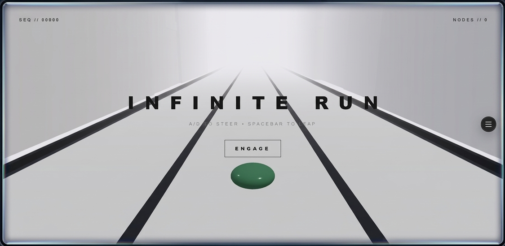

# ♾️ Infinite-Run
### *Cinematic 3D Browser Gaming | High-Fidelity UI/UX*



---

## 📖 Overview
**Infinite-Run** is a high-performance 3D browser-based experience. By merging the technical precision of **Three.js** with professional-grade UI/UX design, this project pushes the boundaries of web-based interactivity. It features cinematic camera systems, responsive design, and a curated brand language for a premium aesthetic.

> **[🚀 CLICK HERE TO VIEW LIVE DEMO](https://infinite-run-three.vercel.app/)**

---

## 🎨 Design System
The visual language is built around a specific brand kit to ensure a sleek, professional aesthetic:

| Element | Specification |
| :--- | :--- |
| **Primary Color** | `#4B58FF` (Electric Blue) |
| **Secondary Color** | `#0D3A52` (Deep Navy) |
| **Headings** | **Garet** |
| **Body Text** | **Inter** |

---

## 🛠 Key Features
*   **Cinematic Engine:** Custom-built camera controls for a premium, immersive feel.
*   **Performance Optimized:** Engineered with Vite for rapid loading and smooth frame rates.
*   **Responsive UI:** Fully fluid layout that adapts seamlessly across all devices.
*   **High-Fidelity Interaction:** Designed with user-centric principles to ensure intuitive gameplay.

---

## 💻 Tech Stack
*   **Core:** [Three.js](https://threejs.org/)
*   **Build & Bundling:** [Vite](https://vitejs.dev/)
*   **Styling:** CSS3
*   **Language:** JavaScript (ES6+)

---

## 🚀 Getting Started
To get a local copy up and running, follow these steps:

```bash
# 1. Clone the repo
git clone [https://github.com/zainali1214/Infinite-Run.git](https://github.com/zainali1214/Infinite-Run.git)

# 2. Enter the directory
cd Infinite-Run

# 3. Install dependencies
npm install

# 4. Start the development server
npm run dev
